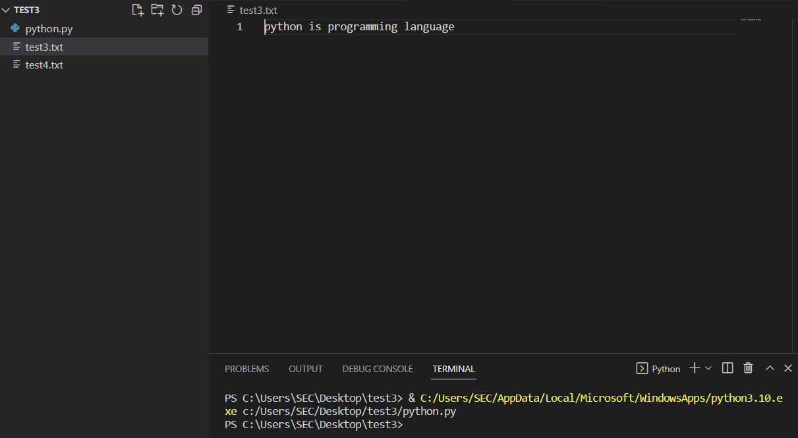
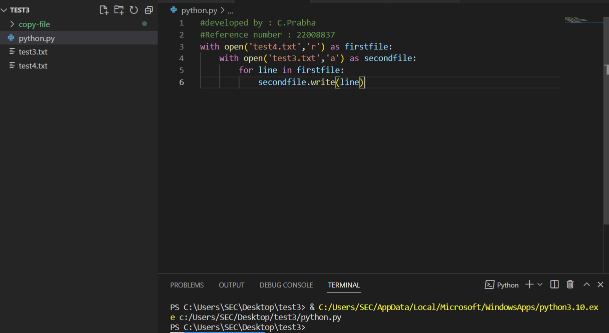
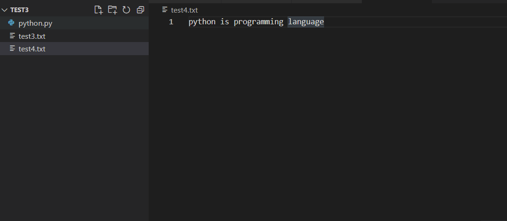

# copy-file
## AIM:
To write a python program for copying the contents from one file to another file.

## EQUIPEMENT'S REQUIRED: 
PC
Anaconda - Python 3.7

## ALGORITHM: 
### Step 1:
Create two txt file.A file which has content [lines.txt] to be copied to the empty [text.txt]file.

### Step 2:
Using write() function to copy the content from line.txt to empty file,text.txt.

### Step 3:
Save and run the python program in terminal.

### Step 4:
The text from the lines.txt file is copied to the empty file text.txt.

### Step 5:
Then the text is shown in empty file text.txt.

### Step 6:
Result is obtained.
 

## PROGRAM:
```
#developed by : C.Prabha
#Reference number : 22008837
with open('test4.txt','r') as firstfile:
    with open('test3.txt','a') as secondfile:
        for line in firstfile:
            secondfile.write(line)

```            

### OUTPUT:






## RESULT:
Thus the program is written to copy the contents from one file to another file.